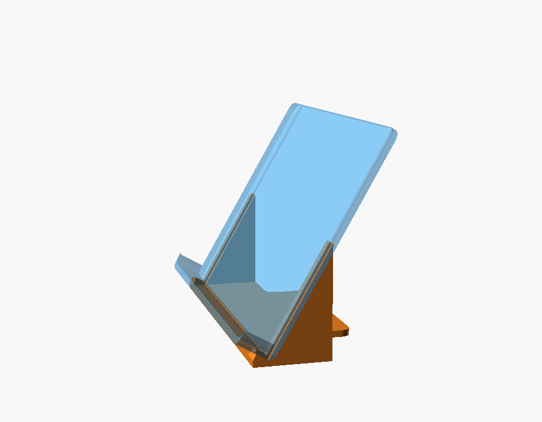
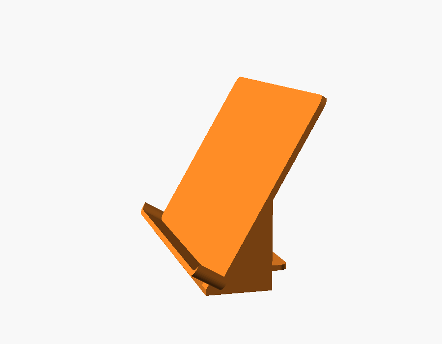
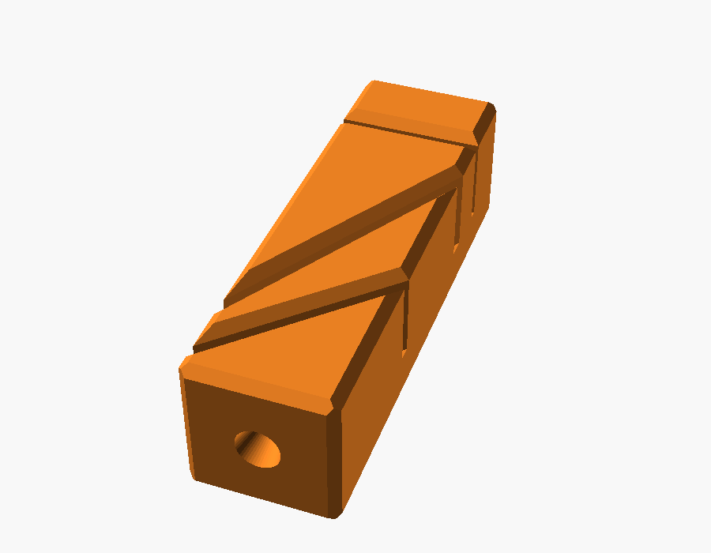
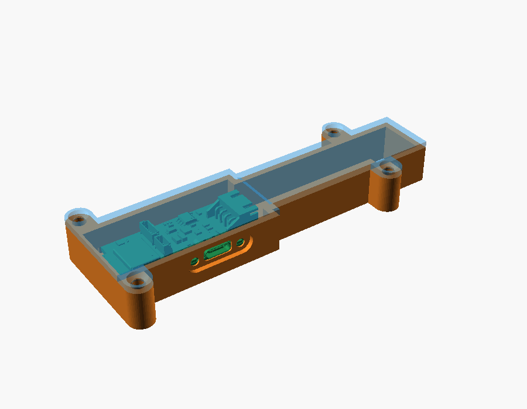
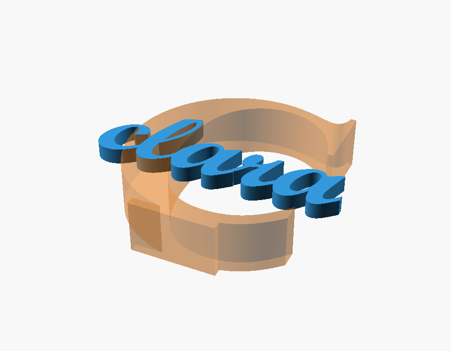
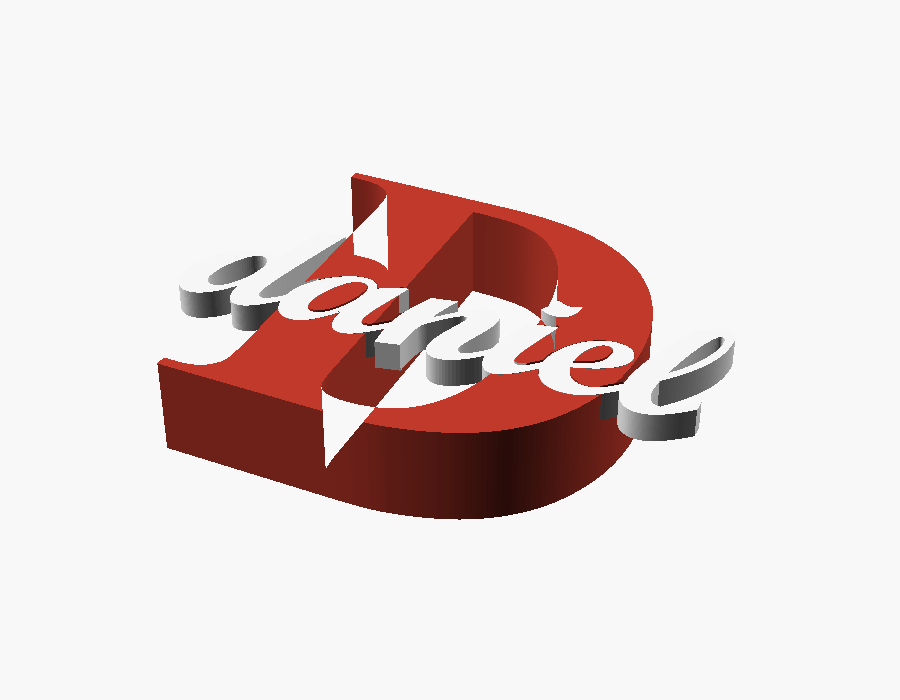
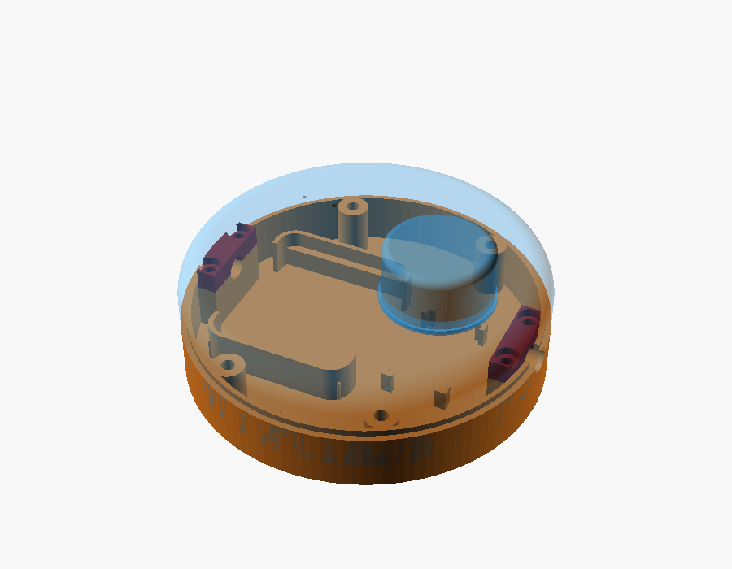
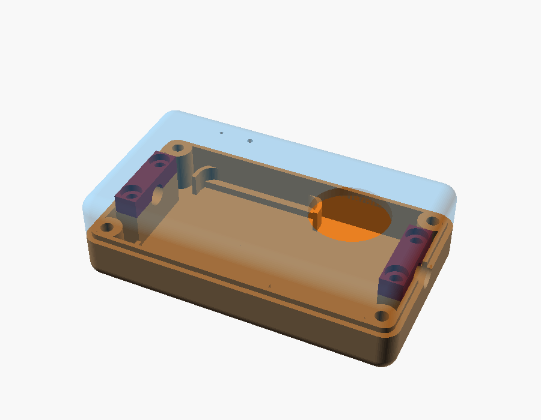

# scad-models

<!-- GENERATED by scripts/build-stl.mjs – do not edit. Edit src/<model>/README.md and the changelog in the .scad header instead. -->

Parametric OpenSCAD models for 3D printing. Every model lives in `src/<model>/` and is built into STL files and a source snapshot per version under `dist/<model>/`.

| Model | Description | Version | Parts |
|---|---|---|---|
| [calendar-card-stand](#calendar-card-stand) | Parametric stand for a pack of cards (e.g. a card calendar of 148 × 105 mm cards, 13 mm thick): a tray that holds the pack at its bottom edge and a separate prop that tilts it to a chosen angle. An all-in-one variant with both parts fused together is included. | 1.0.1 | `holder`, `prop`, `all-in-one` |
| [filament-cutting-holder](#filament-cutting-holder) | Parametric block with a filament channel for cutting filament at defined angles: a 90° cutter slot at one end, angled slots (by default 60° and 45°) at the other end, chamfered edges and magnet holes in the bottom face. | 1.0.0 | `holder` |
| [laskakit-wled-case](#laskakit-wled-case) | Slim case with a lid for the LaskaKit ESP32 WLED controller board, redrawn as a parametric OpenSCAD model. Based on the LaskaKit ESPwled slim case: <https://github.com/LaskaKit/ESPwled/tree/main/3D/slimcase.3mf> | 1.0.0 | `case`, `lid` |
| [name-letter](#name-letter) | Big capital first letter of a name with the whole name inlaid across it. Two parts: `letter` (with a pocket) and `name` (the inlay to glue in); print them in two colours. | 1.0.1 | `letter`, `name` |
| [zbminir2-cord-floor-switch](#zbminir2-cord-floor-switch) | Round two-part enclosure for a Sonoff ZBMINIR2 module with a cable passage and clamp on both ends, plus a floor-switch button with a spring-loaded cap. | 1.0.0 | `base`, `lid`, `clamp`, `cap` |
| [zbminir2-cord-switch](#zbminir2-cord-switch) | Rectangular two-part enclosure for a Sonoff ZBMINIR2 module with a cable passage and clamp on both short sides. Superseded by the round variant `zbminir2-cord-floor-switch`. | 1.0.0 | `base`, `lid`, `clamp` |

## calendar-card-stand

Parametric stand for a pack of cards (e.g. a card calendar of 148 × 105 mm cards, 13 mm thick): a tray that holds the pack at its bottom edge and a separate prop that tilts it to a chosen angle. An all-in-one variant with both parts fused together is included.

 

- Source: [`src/calendar-card-stand/calendar-card-stand.scad`](src/calendar-card-stand/calendar-card-stand.scad)
- Documentation: [`src/calendar-card-stand/README.md`](src/calendar-card-stand/README.md)
- Current version: **1.0.1**
- Parts: `holder`, `prop`, `all-in-one`

| Version | Download (STL) | Source | Changes |
|---|---|---|---|
| 1.0.1 | [calendar-card-stand-2-part-holder.stl](dist/calendar-card-stand/v1.0.1/calendar-card-stand-2-part-holder.stl) [calendar-card-stand-2-part-prop.stl](dist/calendar-card-stand/v1.0.1/calendar-card-stand-2-part-prop.stl) [calendar-card-stand-all-in-one-all-in-one.stl](dist/calendar-card-stand/v1.0.1/calendar-card-stand-all-in-one-all-in-one.stl) | [calendar-card-stand-v1.0.1.scad](dist/calendar-card-stand/v1.0.1/calendar-card-stand-v1.0.1.scad) | presets 2-part (holder + prop) and all-in-one, coloured preview of the assembled stand; fix: cube() in holder() called with wrong arguments (same geometry, no warning) |
| 1.0.0 | [calendar-card-stand-all-in-one.stl](dist/calendar-card-stand/v1.0.0/calendar-card-stand-all-in-one.stl) [calendar-card-stand-holder.stl](dist/calendar-card-stand/v1.0.0/calendar-card-stand-holder.stl) [calendar-card-stand-prop.stl](dist/calendar-card-stand/v1.0.0/calendar-card-stand-prop.stl) | [calendar-card-stand-v1.0.0.scad](dist/calendar-card-stand/v1.0.0/calendar-card-stand-v1.0.0.scad) | Initial versioned release: card holder plus a separate prop that tilts it to stand_angle, the prop cut off at prop_cut_height, plus an all-in-one variant with both fused together |

## filament-cutting-holder

Parametric block with a filament channel for cutting filament at defined angles: a 90° cutter slot at one end, angled slots (by default 60° and 45°) at the other end, chamfered edges and magnet holes in the bottom face.

- Source: [`src/filament-cutting-holder/filament-cutting-holder.scad`](src/filament-cutting-holder/filament-cutting-holder.scad)
- Documentation: [`src/filament-cutting-holder/README.md`](src/filament-cutting-holder/README.md)
- Current version: **1.0.0**
- Parts: `holder`

| Version | Download (STL) | Source | Changes |
|---|---|---|---|
| 1.0.0 | [filament-cutting-holder-holder.stl](dist/filament-cutting-holder/v1.0.0/filament-cutting-holder-holder.stl) | [filament-cutting-holder-v1.0.0.scad](dist/filament-cutting-holder/v1.0.0/filament-cutting-holder-v1.0.0.scad) | Initial versioned release: filament cutting holder with 90° and angled cutter slots, chamfered edges and magnet holes |

## laskakit-wled-case

Slim case with a lid for the LaskaKit ESP32 WLED controller board, redrawn as a parametric OpenSCAD model. Based on the LaskaKit ESPwled slim case: <https://github.com/LaskaKit/ESPwled/tree/main/3D/slimcase.3mf>

- Source: [`src/laskakit-wled-case/laskakit-wled-case.scad`](src/laskakit-wled-case/laskakit-wled-case.scad)
- Documentation: [`src/laskakit-wled-case/README.md`](src/laskakit-wled-case/README.md)
- Current version: **1.0.0**
- Parts: `case`, `lid`

| Version | Download (STL) | Source | Changes |
|---|---|---|---|
| 1.0.0 | [laskakit-wled-case-case.stl](dist/laskakit-wled-case/v1.0.0/laskakit-wled-case-case.stl) [laskakit-wled-case-lid.stl](dist/laskakit-wled-case/v1.0.0/laskakit-wled-case-lid.stl) | [laskakit-wled-case-v1.0.0.scad](dist/laskakit-wled-case/v1.0.0/laskakit-wled-case-v1.0.0.scad) | first release: 12 mm high case with cable tunnel, M3 heat-set insert ears and USB-C recess, plus lid with countersunk M3 pads |

## name-letter

Big capital first letter of a name with the whole name inlaid across it. Two parts: `letter` (with a pocket) and `name` (the inlay to glue in); print them in two colours.

 

- Source: [`src/name-letter/name-letter.scad`](src/name-letter/name-letter.scad)
- Documentation: [`src/name-letter/README.md`](src/name-letter/README.md)
- Current version: **1.0.1**
- Parts: `letter`, `name`

| Version | Download (STL) | Source | Changes |
|---|---|---|---|
| 1.0.1 | [name-letter-clara-letter.stl](dist/name-letter/v1.0.1/name-letter-clara-letter.stl) [name-letter-clara-name.stl](dist/name-letter/v1.0.1/name-letter-clara-name.stl) [name-letter-daniel-letter.stl](dist/name-letter/v1.0.1/name-letter-daniel-letter.stl) [name-letter-daniel-name.stl](dist/name-letter/v1.0.1/name-letter-daniel-name.stl) | [name-letter-v1.0.1.scad](dist/name-letter/v1.0.1/name-letter-v1.0.1.scad) | fix: the name pocket in the letter ignored name_lower_case, so it did not match the inlay |
| 1.0.0 | [name-letter-daniel-letter.stl](dist/name-letter/v1.0.0/name-letter-daniel-letter.stl) [name-letter-daniel-name.stl](dist/name-letter/v1.0.0/name-letter-daniel-name.stl) [name-letter-eliska-letter.stl](dist/name-letter/v1.0.0/name-letter-eliska-letter.stl) [name-letter-eliska-name.stl](dist/name-letter/v1.0.0/name-letter-eliska-name.stl) [name-letter-honza-letter.stl](dist/name-letter/v1.0.0/name-letter-honza-letter.stl) [name-letter-honza-name.stl](dist/name-letter/v1.0.0/name-letter-honza-name.stl) [name-letter-klara-letter.stl](dist/name-letter/v1.0.0/name-letter-klara-letter.stl) [name-letter-klara-name.stl](dist/name-letter/v1.0.0/name-letter-klara-name.stl) [name-letter-petra-letter.stl](dist/name-letter/v1.0.0/name-letter-petra-letter.stl) [name-letter-petra-name.stl](dist/name-letter/v1.0.0/name-letter-petra-name.stl) [name-letter-terezka-letter.stl](dist/name-letter/v1.0.0/name-letter-terezka-letter.stl) [name-letter-terezka-name.stl](dist/name-letter/v1.0.0/name-letter-terezka-name.stl) [name-letter-tom-letter.stl](dist/name-letter/v1.0.0/name-letter-tom-letter.stl) [name-letter-tom-name.stl](dist/name-letter/v1.0.0/name-letter-tom-name.stl) | [name-letter-v1.0.0.scad](dist/name-letter/v1.0.0/name-letter-v1.0.0.scad) | first release: letter + name inlay, assembled coloured preview, presets per name, optional stand (auto/yes/no) |

## zbminir2-cord-floor-switch

Round two-part enclosure for a Sonoff ZBMINIR2 module with a cable passage and clamp on both ends, plus a floor-switch button with a spring-loaded cap.

- Source: [`src/zbminir2-cord-floor-switch/zbminir2-cord-floor-switch.scad`](src/zbminir2-cord-floor-switch/zbminir2-cord-floor-switch.scad)
- Documentation: [`src/zbminir2-cord-floor-switch/README.md`](src/zbminir2-cord-floor-switch/README.md)
- Current version: **1.0.0**
- Parts: `base`, `lid`, `clamp`, `cap`

| Version | Download (STL) | Source | Changes |
|---|---|---|---|
| 1.0.0 | [zbminir2-cord-floor-switch-base.stl](dist/zbminir2-cord-floor-switch/v1.0.0/zbminir2-cord-floor-switch-base.stl) [zbminir2-cord-floor-switch-cap.stl](dist/zbminir2-cord-floor-switch/v1.0.0/zbminir2-cord-floor-switch-cap.stl) [zbminir2-cord-floor-switch-clamp.stl](dist/zbminir2-cord-floor-switch/v1.0.0/zbminir2-cord-floor-switch-clamp.stl) [zbminir2-cord-floor-switch-lid.stl](dist/zbminir2-cord-floor-switch/v1.0.0/zbminir2-cord-floor-switch-lid.stl) | [zbminir2-cord-floor-switch-v1.0.0.scad](dist/zbminir2-cord-floor-switch/v1.0.0/zbminir2-cord-floor-switch-v1.0.0.scad) | Initial versioned release: round two-part enclosure (base + lid) with cable clamps, ZBMINIR frames and ribs that grow with inner_z, floor switch feet, guide sleeve and button cap |

## zbminir2-cord-switch

Rectangular two-part enclosure for a Sonoff ZBMINIR2 module with a cable passage and clamp on both short sides. Superseded by the round variant `zbminir2-cord-floor-switch`.

- Source: [`src/zbminir2-cord-switch/zbminir2-cord-switch.scad`](src/zbminir2-cord-switch/zbminir2-cord-switch.scad)
- Documentation: [`src/zbminir2-cord-switch/README.md`](src/zbminir2-cord-switch/README.md)
- Current version: **1.0.0**
- Parts: `base`, `lid`, `clamp`

| Version | Download (STL) | Source | Changes |
|---|---|---|---|
| 1.0.0 | [zbminir2-cord-switch-base.stl](dist/zbminir2-cord-switch/v1.0.0/zbminir2-cord-switch-base.stl) [zbminir2-cord-switch-clamp.stl](dist/zbminir2-cord-switch/v1.0.0/zbminir2-cord-switch-clamp.stl) [zbminir2-cord-switch-lid.stl](dist/zbminir2-cord-switch/v1.0.0/zbminir2-cord-switch-lid.stl) | [zbminir2-cord-switch-v1.0.0.scad](dist/zbminir2-cord-switch/v1.0.0/zbminir2-cord-switch-v1.0.0.scad) | Initial versioned release: rectangular two-part enclosure; "base" is the lower half and "lid" the upper half |

## License

Copyright (c) 2026 Jan Kropáč (hondzik)

- **Models** (`src/**/*.scad`), the **generated files** in `dist/` (STL, source snapshots, images) and the **documentation** are licensed under [**CC BY 4.0**](LICENSE) – you may share and adapt them, also commercially, as long as you give appropriate credit and indicate changes.
- The **build tooling** (`scripts/`, `package.json`) is licensed under the [**MIT License**](LICENSE-CODE), because Creative Commons licenses are not recommended for software.

The enclosures hold mains-voltage devices – see the safety notes in the model documentation. Everything is provided as-is, without any warranty.
